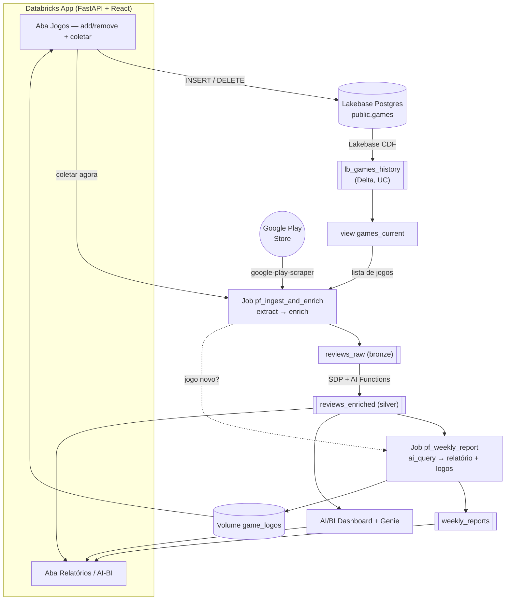

# Player Feedback Analysis

Demo Databricks que monitora reviews de **qualquer jogo** da Google Play Store: coleta os
comentários, enriquece com **AI Functions** (7 dimensões + sentimento), gera relatórios semanais
por jogo e serve tudo num **Databricks App** (com **AI/BI Dashboard + Genie** embeddados). Os jogos
monitorados são cadastrados **pela própria interface do App** — sem editar código. Tudo provisionado
via **Databricks Asset Bundles (DABs)**.

## 1. Arquitetura



- **Cadastro de jogos**: o App grava no **Lakebase** (Postgres). O **Lakebase CDF** materializa as
  mudanças na tabela Delta `lb_games_history`, da qual deriva a view `games_current` — a fonte de
  verdade lida pelos jobs. Ao clicar em "coletar agora", o App espera o CDF refletir o cadastro e
  então dispara **uma** execução do job de coleta.
- **Coleta + enriquecimento** (`pf_ingest_and_enrich`): extrai reviews (dedup/filtro na fonte;
  backfill por data para jogos novos), enriquece via SDP e, se houver jogo novo, dispara o relatório.
- **Relatório semanal + logos** (`pf_weekly_report`): `ai_query` gera o resumo por jogo e baixa os
  logos para o Volume. Roda no agendamento semanal e sob demanda (jogos novos).
- **App**: relatórios por jogo, dashboard AI/BI + Genie embeddados e a tela de gestão de jogos.

## 2. Estrutura do repositório

```
player_feedback/
├── databricks.yml            # bundle + variáveis + target dev
├── resources/                # segmentado por workflow, não por tipo de objeto
│   ├── pf_compute.yml         # SQL Warehouse serverless (2X-Small)
│   ├── pf_lakebase.yml        # Lakebase Autoscaling (project/branch/endpoint)
│   ├── pf_daily.yml           # setup + ingestão/enriquecimento (job + pipeline SDP)
│   ├── pf_weekly.yml          # relatório semanal + coleta de logos
│   └── pf_frontend.yml        # AI/BI Dashboard + App (bindings/permissões do SP)
├── src/                      # notebooks (achatado)
│   ├── setup.py               # tabela Postgres + CDF + role do SP, schema, volume, tabelas, view, grants
│   ├── extract_reviews.py     # coleta (lê games_current)
│   ├── enrich_reviews.py      # SDP (reviews_raw → reviews_enriched)
│   ├── weekly_report.py       # relatório semanal
│   ├── extract_logos.py       # logos → Volume
│   └── player_feedback.lvdash.json  # AI/BI Dashboard
└── app/                      # FastAPI (server/) + React/Vite (frontend/)
```

## 3. Deploy

Pré-requisito único: um **catálogo** no workspace (o `pf_setup` tenta criar `player_feedback_catalog`
best-effort; se não tiver permissão de metastore, crie-o antes ou ajuste a variável `catalog`).
Preencha `workspace.host` e `run_as.user_name` em `databricks.yml`. O warehouse serverless, jobs,
pipeline, dashboard, App e o **Lakebase Autoscaling** (project/branch/endpoint) vêm no bundle. Só a
**CDF config** não tem recurso DAB, então o `pf_setup` a cria — junto da tabela `public.games`, do
role Postgres do SP, da view `games_current` e dos grants de UC — imperativamente via `w.postgres`.

> **Migração destrutiva (rebuild):** o bundle **NÃO adota** um Lakebase pré-existente. Se já existe um
> projeto `pf-games`, o dono deve **apagá-lo** primeiro; o deploy recria project/branch/endpoint e o
> `pf_setup` recria tabela/CDF/role/view/grants. **Isto substitui o Lakebase atual e re-ingere os dados.**

```bash
# -p <profile> = seu profile da CLI

# 0) SÓ se já existe um Lakebase pf-games: o dono apaga (o bundle não adota projeto legado).
databricks postgres delete-project projects/pf-games -p <profile>

# 1) Cria warehouse, jobs, pipeline, dashboard, App E o Lakebase (project/branch/endpoint).
databricks bundle validate -t dev -p <profile>
databricks bundle deploy   -t dev -p <profile>

# 2) Cria tabela public.games + REPLICA IDENTITY FULL + CDF + role do SP + view + grants de UC.
databricks bundle run pf_setup -t dev -p <profile>

# 3) Re-alimenta os dados (coleta + enriquecimento) — o Lakebase foi recriado do zero.
databricks bundle run pf_ingest_and_enrich -t dev -p <profile>

# 4) Sobe o App.
databricks bundle run pf_app -t dev -p <profile>
```

Depois é só abrir o App → aba **Jogos** → adicionar um ou mais jogos → **Disparar coleta agora**.

## 4. Adicionar um jogo pelo App

Na aba **Jogos** do App:

1. Em **Adicionar jogos**, preencha o **nome** e o **ID da Play Store** de cada jogo (dá para
   adicionar vários de uma vez) e clique em **Salvar jogos**.
2. Clique em **Disparar coleta agora** — uma única execução coleta os reviews de todos os jogos
   cadastrados. Jogos novos fazem backfill dos últimos meses e geram o primeiro relatório semanal.

**O que é o ID e como encontrar:** é o identificador do app na Google Play (o *package name*), que
aparece na URL da página do jogo, no parâmetro `id`:

```
https://play.google.com/store/apps/details?id=com.king.candycrushsaga
                                               └──────────┬─────────┘
                                                    ID (package name)
```

Abra a página do jogo na Play Store (site ou app), copie o valor após `id=` e cole no campo de ID.
